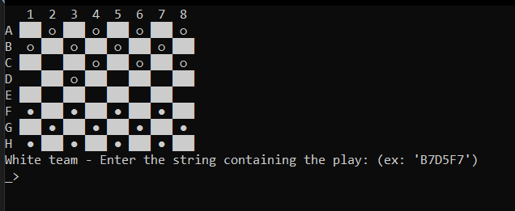

# Checkers Game

Checkers game implemented using python.

## Images


## Steps to execute
On a prompt, execute the command.
```cmd
python init.py
```

## How to play
Type in a combination of positions, the first being one piece on the board, and the others being the place they should move next.

## Rules

The game follows some rules such as:

1. Whenever possible, **prioritize the move that captures the most pieces.** Thus, this means that some moves that would be possible in a normal checkers game, will not be allowed in this version.
2. Whenever able to, a piece is **obligated to capture another one**.